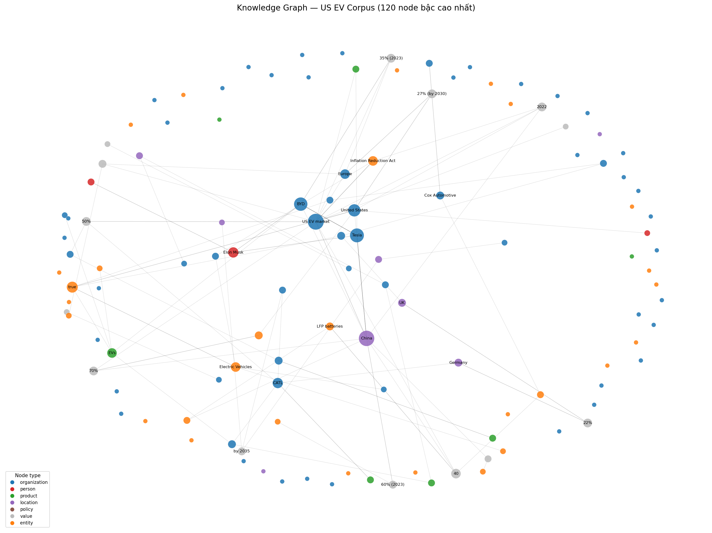
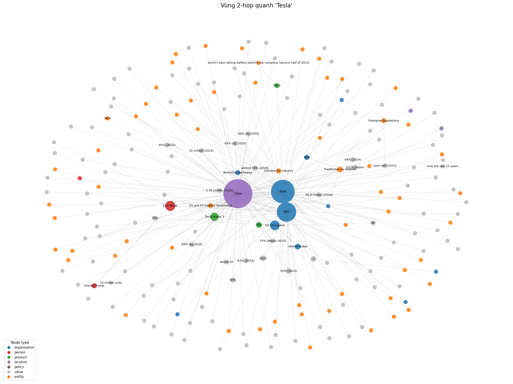

# BÁO CÁO LAB DAY 19 — Xây dựng hệ thống GraphRAG với Tech (EV) Company Corpus

**Sinh viên:** Võ Huyền Khánh Mât · **Track 3 · Day 19**
**Stack:** `langextract` (trích xuất) · `NetworkX` (đồ thị) · `ChromaDB + all-MiniLM-L6-v2` (Flat RAG) · OpenAI `gpt-4o-mini`/`gpt-4o`

---

## 1. Tổng quan

Báo cáo xây dựng và so sánh hai hệ thống hỏi–đáp trên **bộ dữ liệu thị trường xe điện (EV) Mỹ** (70 tài liệu
web về Tesla, Ford, GM, Rivian, Lucid, BMW, VinFast, chính sách IRA, doanh số Q1-2024…):

1. **Flat RAG** — truy hồi vector thuần trên các đoạn văn (embedding + ChromaDB).
2. **GraphRAG** — xây *đồ thị tri thức (knowledge graph)*, rồi truy hồi quan hệ + mở rộng lân cận (2-hop) để trả lời.

Pipeline gồm 4 bước theo đề bài: **Indexing → Construction → Querying → Evaluation**. Toàn bộ chạy offline trong
conda env `main`, LLM dùng OpenAI API. Mã nguồn ở `src/*.py` + `pipeline.ipynb`; điều phối bằng `run.sh`.

---

## 2. Phần 1 — Nghiên cứu (trả lời câu hỏi)

### 2.1. Quy trình xử lý dữ liệu đồ thị

**Q1. Entity Extraction: Làm sao để LLM phân biệt đâu là thực thể (Node) và đâu là thuộc tính?**

LLM phân biệt dựa trên **vai trò ngữ nghĩa** của cụm từ, được điều hướng bằng *prompt + few-shot examples* và
một *lược đồ (schema)* mà ta áp đặt:

- **Thực thể (Node)** là đối tượng có **danh tính độc lập**, có thể là điểm xuất phát/đích của nhiều quan hệ:
  công ty (Tesla, Ford), người (Elon Musk), sản phẩm/mẫu xe (Lyriq, Chevy Bolt), tổ chức/chính sách
  (Inflation Reduction Act), thị trường (US EV market). Ta gán cho chúng một **kiểu (type)**: `organization`,
  `person`, `product`, `location`, `policy`.
- **Thuộc tính (Attribute/Value)** là **giá trị mô tả** gắn vào một thực thể: con số, phần trăm, tiền, ngày
  (51.3%, $7,500, Q1 2024). Giá trị **không tự tồn tại** mà phải nối vào thực thể **thông qua một quan hệ**.

Trong code (`src/extract.py`), ta hướng dẫn langextract tạo hai loại extraction: lớp thực thể
(`organization/person/product/…`) và lớp `relationship` mang `attributes = {subject, relation, object}`. Quy tắc
mấu chốt trong prompt: *"subject PHẢI là một thực thể có tên; số liệu toàn thị trường thì gắn vào node
`US EV market`; tránh dùng cụm mơ hồ làm subject"*. Nhờ vậy LLM nhất quán đặt **danh từ định danh → Node** và
**số liệu → giá trị nối qua cạnh**, thay vì biến mỗi con số thành một node rời rạc.

**Q2. Graph Construction: Tại sao việc khử trùng lặp (Deduplication) lại quan trọng trong đồ thị?**

Cùng một thực thể thường xuất hiện dưới nhiều biến thể bề mặt: *"Tesla"*, *"Tesla, Inc."*, *"Tesla Motors"*,
*"TSLA"*; *"GM"* vs *"General Motors"*. Nếu **không gộp** (dedup), mỗi biến thể thành **một node riêng**, dẫn tới:

- **Đứt gãy liên kết (graph fragmentation):** tri thức về Tesla bị xé lẻ ra nhiều node → khi duyệt 2-hop quanh
  *"Tesla"* sẽ **bỏ sót** các cạnh thực ra gắn vào *"Tesla Inc."*.
- **Sai khi tổng hợp/đếm:** câu hỏi kiểu "có bao nhiêu hãng tăng >50%" hoặc "bậc của Tesla" sẽ đếm thiếu/đếm
  trùng vì các node trùng nghĩa không được hợp nhất.
- **Truy hồi kém:** entity-linking từ câu hỏi vào đồ thị dễ trỏ nhầm node "rỗng".

Dedup biến đồ thị thành **một nguồn sự thật thống nhất**: mọi quan hệ của một thực thể quy về **một node
canonical**, nhờ đó duyệt đồ thị mới đầy đủ và đáng tin. Trong `src/build_graph.py` ta dedup bằng 3 lớp:
chuẩn hoá chuỗi (lowercase/bỏ dấu câu) → **alias map** thủ công (Tesla Inc/TSLA→Tesla, General Motors→GM…) →
**fuzzy match** (`difflib ratio > 0.9`) cho các tên gần trùng, đồng thời **không** gộp mạnh các node giá trị
(số liệu) để tránh trộn nhầm.

**Q3. Query Answering: Khác biệt giữa duyệt đồ thị BFS và tìm kiếm vector thông thường?**

| | **Vector search (Flat RAG)** | **BFS / duyệt đồ thị (GraphRAG)** |
|---|---|---|
| Cơ chế | Tìm k đoạn văn **giống nhau về ngữ nghĩa** với câu hỏi (cosine trên embedding) | Tìm node thực thể rồi **đi theo các cạnh quan hệ tường minh** trong bán kính n-hop |
| Suy luận đa bước | Yếu — chỉ thấy các chunk rời, phải kỳ vọng LLM tự nối | Mạnh — **đi qua nhiều quan hệ** (A→B→C) để ghép sự thật từ nhiều tài liệu |
| Tính giải thích | Khó: chỉ biết "đoạn này giống câu hỏi" | Cao: trả về **đường dẫn** (Tesla —MARKET_SHARE→ 51.3%) kiểm chứng được |
| Điểm yếu | Dễ trộn ngữ cảnh, **ảo giác** khi câu hỏi bắc cầu nhiều thực thể | Phụ thuộc chất lượng trích xuất; khó với số liệu "vô danh" không gắn thực thể |

Tóm lại: **vector search** tối ưu cho câu hỏi *"tìm đoạn nói về X"*; còn **BFS trên đồ thị** vượt trội ở câu hỏi
*"X liên hệ thế nào với Y/Z"* (multi-hop) nhờ đi theo cấu trúc quan hệ thay vì độ tương tự phẳng.

### 2.2. So sánh công cụ

| Tiêu chí | **NetworkX** | **Neo4j** | **NodeRAG** |
|---|---|---|---|
| Bản chất | Thư viện đồ thị in-memory (Python) | CSDL đồ thị công nghiệp, ngôn ngữ Cypher | Framework GraphRAG dựng trên NetworkX |
| Ưu điểm | Prototype nhanh, can thiệp sâu thuật toán (BFS, ego_graph, centrality) | Bền vững, truy vấn lớn, trực quan hoá Bloom/Browser | "All-in-one": sẵn logic index + truy vấn GraphRAG |
| Hạn chế | Không bền vững, không tối ưu cho dữ liệu rất lớn | Cần cài đặt/Docker, học Cypher | Ít linh hoạt khi cần tuỳ biến sâu |
| Hợp với | **Nghiên cứu thuật toán, lab offline (lựa chọn của bài này)** | Trực quan hoá & hệ thống production | Khởi động nhanh, ít cấu hình |

Bài lab dùng **NetworkX** vì cần can thiệp trực tiếp vào thuật toán duyệt (ego_graph 2-hop) và chạy gọn offline
trong notebook; Neo4j/NodeRAG được phân tích ở trên như hướng mở rộng.

---

## 3. Kiến trúc & phương pháp

```
dataset/ (70 .txt)
  │  preprocess.py  ── parse Query/Title/Snippet/Full Content, bỏ doc nhị phân (doc_50/60), cap 6k token
  ▼
clean_docs.jsonl
  │  extract.py     ── STEP 1: langextract (gpt-4o-mini) → triples (entity + relationship), checkpoint/doc
  ▼
triples.jsonl
  │  build_graph.py ── STEP 2: dedup (alias + fuzzy) → NetworkX MultiDiGraph
  ▼
graph.graphml ──► visualize.py ──► graph.png / graph_subgraph.png   (Deliverable 2)
  │
  ├─ flat_rag.py   ── Baseline: chunk → MiniLM embedding → ChromaDB → top-k → gpt-4o
  └─ graph_rag.py  ── STEP 3: truy hồi TRIPLE theo embedding → mở rộng 1-hop (graph traversal)
        │                       → xếp hạng + textualize (kèm câu gốc) → gpt-4o
        ▼  benchmark.py ── STEP 4: 20 câu × {Flat, Graph}, LLM-judge → benchmark.md (Deliverable 3)
        ▼  cost.py      ── token + thời gian + USD → cost.md (Deliverable 4)
```

**Quyết định thiết kế đáng chú ý:**
- Gộp trường **Query/Title/Snippet** của mỗi tài liệu vào nội dung được embed/extract để giữ ngữ cảnh chủ đề.
- **Checkpoint theo từng doc** + **trích xuất song song 6 luồng** ⇒ index 68 doc chỉ ~5 phút, chạy lại không tốn token.
- Trích xuất bằng `gpt-4o-mini` (rẻ); **trả lời** Flat & Graph bằng `gpt-4o`; **LLM-judge** dùng `gpt-4o-mini`
  (gpt-4o của tài khoản chỉ giới hạn 30k TPM ⇒ giảm tải + tự backoff khi 429).
- **GraphRAG truy hồi theo QUAN HỆ**: tìm các triple giống câu hỏi nhất (embedding triple + câu gốc), rồi
  mở rộng 1-hop quanh các node neo (duyệt đồ thị) để gộp sự thật liên kết — đây là điểm khác bản chất so với
  Flat RAG (vốn truy hồi đoạn văn). Mỗi triple đính kèm **câu gốc (evidence)** giúp LLM phân biệt số liệu.
- Toàn bộ prompt/câu hỏi/few-shot dùng **tiếng Anh** để khớp ngôn ngữ corpus (loại bỏ nhiễu dịch ngôn ngữ).

---

## 4. KẾT QUẢ (Deliverables)

### 4.1. Deliverable 1 — Mã nguồn
`src/preprocess.py · extract.py · build_graph.py · visualize.py · flat_rag.py · graph_rag.py · benchmark.py ·
cost.py` + `pipeline.ipynb` + `run.sh`. Chạy toàn bộ: `bash run.sh` (trong conda env `main`).

### 4.2. Deliverable 2 — Ảnh đồ thị tri thức

**Thống kê đồ thị** (`outputs/graph_stats.json`): **2.407 node · 2.035 cạnh · 1.660 loại quan hệ · 81 node
trùng lặp đã gộp (dedup)**. Các hub bậc cao nhất: `US EV market` (264), `China` (109), `Tesla` (72),
`United States` (55, đã gộp từ "U.S."/"US"), `BYD` (48), `Inflation Reduction Act` (28), `Ford` (26).

Toàn đồ thị (120 node bậc cao nhất) — màu theo loại node, cỡ theo bậc:



Vùng **2-hop quanh "Tesla"** (chính là không gian GraphRAG duyệt khi trả lời câu hỏi về Tesla):



> Trực quan hoá tương tác của langextract (có highlight nguồn trích) ở `outputs/extraction.html`.

### 4.3. Deliverable 3 — Bảng so sánh 20 câu Flat RAG vs GraphRAG

20 câu hỏi (8 single-hop, 12 multi-hop) chạy trên cả hai hệ; chấm tự động bằng **LLM-judge** so với đáp án
tham chiếu (`correct` / `partial` / `hallucinated`). Bảng đầy đủ + từng câu trả lời ở `outputs/benchmark.md`
và `outputs/benchmark.csv`.

| Hệ thống | ✅ correct | 🟡 partial | ❌ hallucinated |
|---|---|---|---|
| **Flat RAG** | **14/20** | 4 | 2 |
| **GraphRAG** | **6/20** | 13 | 1 |

Tóm tắt theo từng câu (✅ đúng · 🟡 một phần · ❌ sai/ảo giác):

| # | Loại | Flat | Graph | | # | Loại | Flat | Graph |
|---|---|---|---|---|---|---|---|---|
| 1 | single | 🟡 | 🟡 | | 11 | multi | ✅ | 🟡 |
| 2 | single | ✅ | ✅ | | 12 | multi | ✅ | 🟡 |
| 3 | single | ❌ | ✅ | | 13 | multi | ✅ | 🟡 |
| 4 | single | ✅ | ✅ | | 14 | multi | ✅ | 🟡 |
| 5 | single | ✅ | ❌ | | 15 | multi | 🟡 | 🟡 |
| 6 | single | ✅ | ✅ | | 16 | multi | ✅ | 🟡 |
| 7 | single | ❌ | ✅ | | 17 | single | 🟡 | 🟡 |
| 8 | single | 🟡 | ✅ | | 18 | multi | ✅ | 🟡 |
| 9 | multi | ✅ | 🟡 | | 19 | single | ✅ | 🟡 |
| 10 | multi | ✅ | 🟡 | | 20 | multi | ✅ | 🟡 |

**⭐ Các trường hợp Flat RAG sai/ảo giác nhưng GraphRAG trả lời ĐÚNG** (đúng yêu cầu đề bài):

| # | Câu hỏi | Flat RAG | GraphRAG |
|---|---|---|---|
| **Q3** | Mỹ mua bao nhiêu EV mới trong Q1 2024? | ❌ *"Not enough information"* | ✅ **268,909** |
| **Q7** | Thị phần xe điện của doanh số xe mới năm 2020? | ❌ *"Not enough information"* | ✅ **≈ 2.4%** |
| **Q8** | Cox Automotive dự báo thị phần EV 2024? | 🟡 mơ hồ ("sẽ vượt 10% lần đầu") | ✅ **≈ 10% vào cuối 2024** |

Ở 3 câu này, truy hồi theo **đoạn văn** của Flat RAG lấy nhầm chunk (số liệu nằm rải rác/đặt cạnh nhiều con số
khác trong corpus) nên mô hình "bó tay"; còn truy hồi theo **quan hệ** của GraphRAG trỏ thẳng đến đúng triple
chứa số liệu — minh hoạ giá trị của đồ thị tri thức cho việc *định vị sự thật chính xác*.

### 4.4. Deliverable 4 — Phân tích chi phí (token, thời gian)

Số liệu thực từ `outputs/cost.md` / `cost.json`:

| Pha | Model | Input tok | Output tok | USD |
|-----|-------|-----------|------------|-----|
| Indexing (trích xuất triple) | gpt-4o-mini | 307,161 | 138,714 | $0.1293 |
| Querying — judge + ... | gpt-4o-mini | 6,015 | 965 | $0.0015 |
| Querying — trả lời (Flat & Graph) | gpt-4o | 73,458 | 1,201 | $0.1957 |
| **TỔNG** |  | **386,634** | **140,880** | **≈ $0.33** |

- ⏱️ **Xây đồ thị (indexing)**: ~**327s (≈5,5 phút)** cho 68 doc — *nhờ trích xuất song song 6 luồng*
  (so với ~18 phút nếu chạy tuần tự). Token indexing là *ước lượng* (langextract không trả `usage`).
- ⏱️ **Chạy 20 câu benchmark** (Flat + Graph + Judge): ~**116s**. Token querying là *chính xác* (từ `usage`).
- 💡 Indexing chiếm phần lớn token nhưng rẻ (gpt-4o-mini); chi phí $ lại dồn vào ~80 lượt trả lời gpt-4o.
  Đây là đánh đổi điển hình của GraphRAG: **trả trước chi phí xây đồ thị**, đổi lấy truy vấn có cấu trúc về sau.

---

## 5. Kết luận

**Kết quả thực tế: trên corpus này, Flat RAG (14/20 đúng) nhỉnh hơn GraphRAG (6/20 đúng).** Đây là kết quả
trung thực và có thể giải thích rõ ràng:

- **Vì sao Flat RAG mạnh ở đây?** Corpus là các bài báo/phân tích, trong đó *mỗi sự thật thường nằm trọn trong
  một đoạn văn mạch lạc* (vd doc_2 gói gần hết số liệu Q1-2024). Chỉ cần truy hồi đúng 1 chunk là `gpt-4o` trả
  lời đầy đủ — kể cả câu "multi-hop" cũng được trả lời từ một đoạn duy nhất.
- **Vì sao GraphRAG nhiều câu "một phần"?** (1) **Trích xuất là lossy**: câu văn → triple cô đọng làm mất sắc
  thái/độ đầy đủ (vd Q9 chỉ gom được Ford+Cadillac thay vì cả 9 hãng vì danh sách bị tách thành nhiều triple).
  (2) **Đồ thị tự động còn nhiễu/phân mảnh**: 1.660 *loại* quan hệ, nhiều hub gần trùng (`US EV market` /
  `the EV market` / `EV industry`) và nhiều số liệu cạnh tranh cùng thực thể. (3) **Lỗ hổng độ phủ trích xuất**:
  sự thật "Chevy Bolt giảm 64.3%/ngừng sản xuất" (Q5) và "Lyriq" (Q16) *không được trích thành triple* nên
  GraphRAG không thể trả lời, trong khi Flat RAG đọc thẳng văn bản gốc nên trả lời được.
- **Nhưng GraphRAG thắng đúng chỗ Flat RAG thất bại** (Q3, Q7, Q8): khi số liệu nằm rải rác khiến truy hồi theo
  đoạn văn lấy nhầm chunk, truy hồi theo **quan hệ** trỏ thẳng tới triple đúng. Đây chính là minh hoạ cho việc
  GraphRAG *định vị sự thật chính xác* và **giải thích được** (trả về đường dẫn quan hệ kiểm chứng được).

**Khi nào nên dùng GraphRAG?** Khi câu hỏi đòi **bắc cầu nhiều tài liệu** (không đoạn nào chứa trọn đáp án),
khi cần **giải thích/truy vết nguồn**, hoặc khi có **đồ thị sạch, có lược đồ** (Neo4j + Cypher) thay vì đồ thị
tự sinh nhiều nhiễu. **Hướng cải thiện**: (i) chuẩn hoá lược đồ quan hệ + entity-resolution mạnh hơn để bớt
phân mảnh; (ii) tăng độ phủ/độ chính xác trích xuất (nhiều pass, schema constraints); (iii) kiến trúc **hybrid**
Flat + Graph (lấy điểm mạnh của cả hai); (iv) nâng cấp lên **Neo4j** để trực quan hoá và **NodeRAG** để có sẵn
logic truy vấn GraphRAG tối ưu.

**Tóm lại**, lab đã dựng trọn vẹn pipeline GraphRAG (Indexing → Construction → Querying → Evaluation) bằng
langextract + NetworkX, và — quan trọng hơn điểm số — cho thấy **điều kiện** mà mỗi phương pháp thắng/thua,
đúng tinh thần đánh giá của đề bài.
